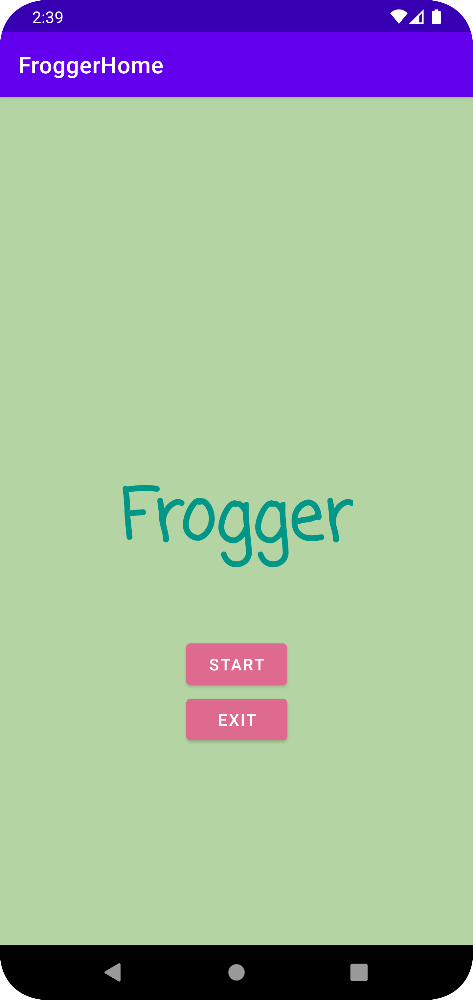
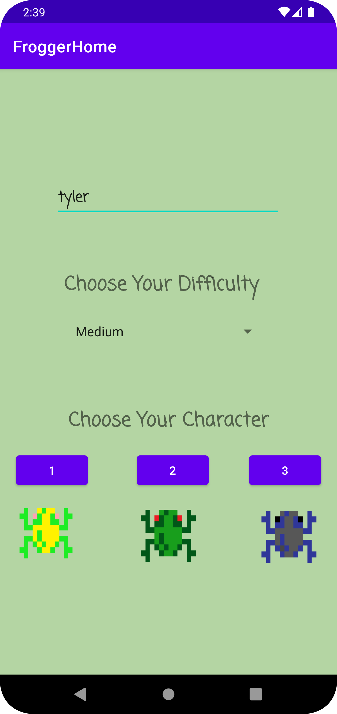
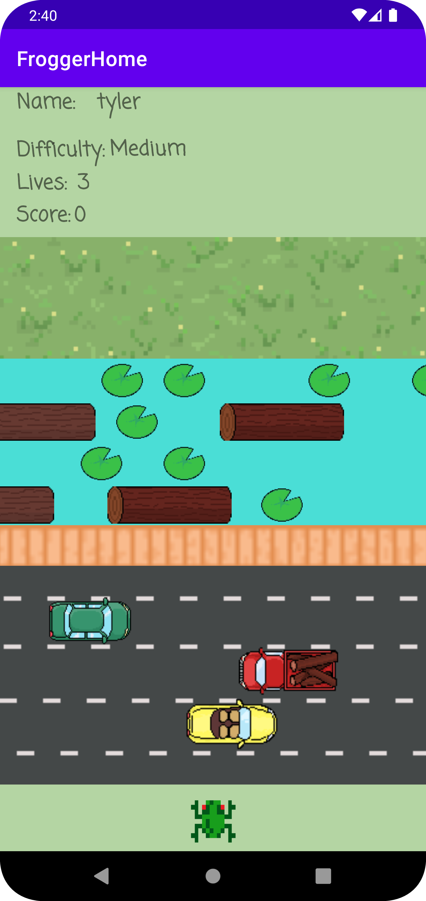
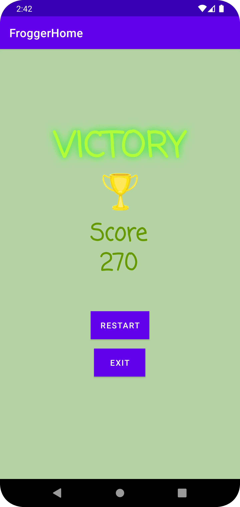
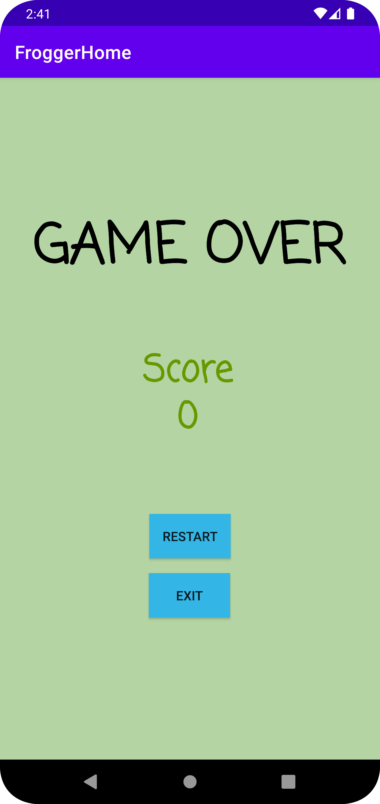

# Frogger

Road-Crossing Android Mobile Game

# Features

| Screen                            | Description                                 |
|-----------------------------------|---------------------------------------------|
|  | **Start Screen**: The initial screen where users can start or quit the game. |
|  | **Configuration Screen**: Allows players to input their name, select difficulty, and choose a character sprite. |
|  | **Game Screen**: The main gameplay screen where players navigate the character across roads and rivers. |
|  | **Victory Screen**: When the player reaches the goal, this screen shows the final score and indicates a win. |
|  | **Game Over Screen**: Displays when the player loses all lives and offers options to restart or quit. |

# Release Notes

### Version 1.4 - Sprint 5:

- **Logs**: Added two types of logs with different gameplay behavior. Players move in the same direction and speed as the log when on top of it. If a player falls off a log, they lose a life.
- **Goal Functionality**: If the player reaches the goal tile, the winning game screen is displayed.
- **Win Screen**: Displays the final score and options to restart or quit the game.

### Version 1.3 - Sprint 4:

- **Water Tiles**: Introduced water tiles where players lose a life upon contact.
- **Collisions and Lives**: Players lose a life if they collide with a vehicle. Implemented the functionality to track lives and transition to the game over screen when lives run out.
- **Game Over Screen**: Added a game over screen that shows the final score and provides options to restart or quit the game.

### Version 1.2 - Sprint 3:

- **Vehicles**: Implemented three types of vehicles, each with different speeds.
- **Scoring**: Players are awarded points based on forward movement.

### Version 1.1 - Sprint 2:

- **Player Movement**: Added the ability for the player to move up, down, left, and right within screen boundaries using a grid/tile system.
- **Map Layout**: Introduced safe, road, and river tiles with varying widths. The goal tile is displayed at the far end of the screen, but no functionality is associated with it yet.

### Version 1.0 - Sprint 1:

- **Start Screen**: Added a start screen with options to start or quit the game.
- **Initial Configuration**: Implemented an input screen for the player's name, difficulty selection, and character sprite selection.
- **Game Screen**: Displayed player name, character sprite, and starting lives on the game screen. No movement or functionality beyond visual setup yet.

## Contributors
-   [Tyler Lin](#)
-   [Doan Tran](#)
-   [Eileen Liu](#)
-   [Hannah Kim](#)
-   [Jennifer Light](#)

